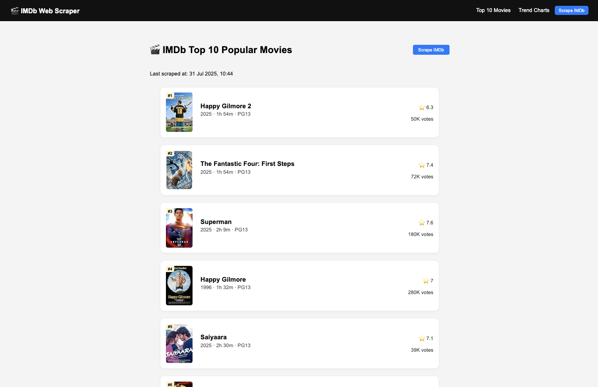
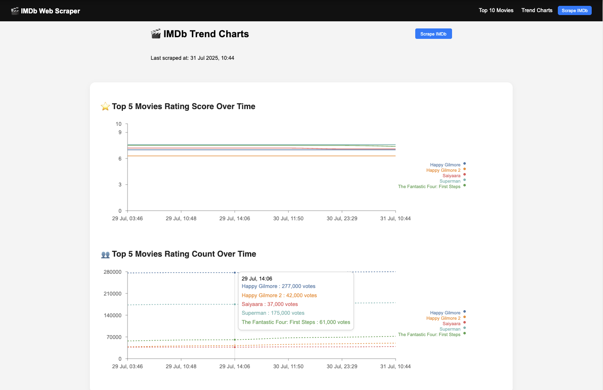

# IMDb Web Scraper

This project is a web application that scrapes [IMDb's list of the most popular movies](https://www.imdb.com/chart/moviemeter/) using Selenium and visualises the top 10 movies and the top 5's rating and vote count trends over time. It is built with a Python Flask backend and a React.js frontend, using Pandas for data transformation and Recharts for visualisation.

---

## Overview

The scraper collects key movie data such as:

- Title
- Release Year
- Duration
- Age Rating (mapped to PG, PG13, R, etc.)
- IMDb Rating
- Vote Count
- Poster Image
- IMDb Link

The frontend displays:
- A ranked top 10 movie list



- Line charts showing IMDb rating and vote count over time, with specific values showing upon hovering data points




- "Last scraped at" timestamp
- A Scrape button to trigger the backend


---

## Technologies Used

### Backend

- **Python**
- **Flask** – API layer and logic
- **Selenium** – Automated scraping using Chrome WebDriver
- **Pandas** – CSV management and data transformation

### Frontend

- **React.js** – UI framework
- **Recharts** – For plotting time-series charts
- **Axios** – For API requests
- **Day.js** – For timestamp formatting
- **Tailwind CSS** – Styling and layout

---

## Setup Instructions

### 1. Clone the Repository

```bash
git clone https://github.com/your-username/imdb-web-scraper.git
cd imdb-web-scraper
```

### 2. Backend Setup (Flask + Selenium)
```bash
cd backend
python3 -m venv venv
source venv/bin/activate  # Windows: venv\Scripts\activate
pip install -r requirements.txt
python app.py
```
This will launch the API at http://localhost:5000

### 3. Frontend Setup (React)
```bash
cd ../frontend
npm install
npm start
```
The frontend will start at http://localhost:3000

